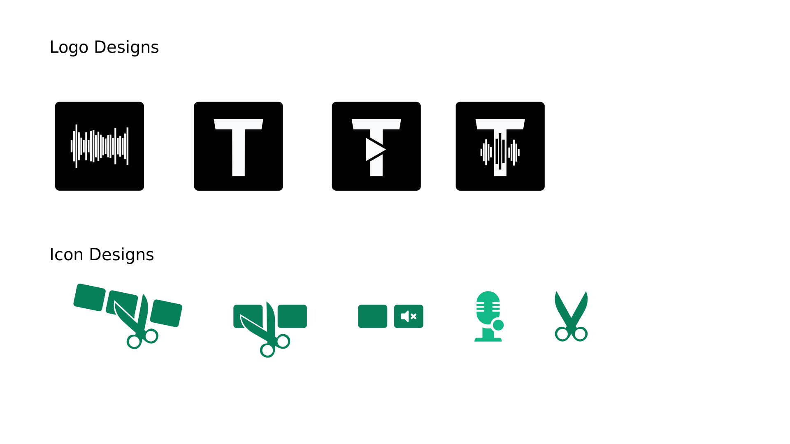

# Tenacity Design Development

Tenacity is a privacy-respecting, free/libre alternative to [Audacity](https://www.audacityteam.org/). It's developed independently by a team of volunteers who keep it away from being taken over by corporate interests and make sure it will always be free and open-source.

## Welcome!

This is a repository for anyone interested in UI/UX design, logo design, or website design to work together on improving Tenacity. Feel free to discuss UI issues, come up with new designs, or showcase your own designs of Tenacity.

## Logo Designs

Author: Songtech-0912

